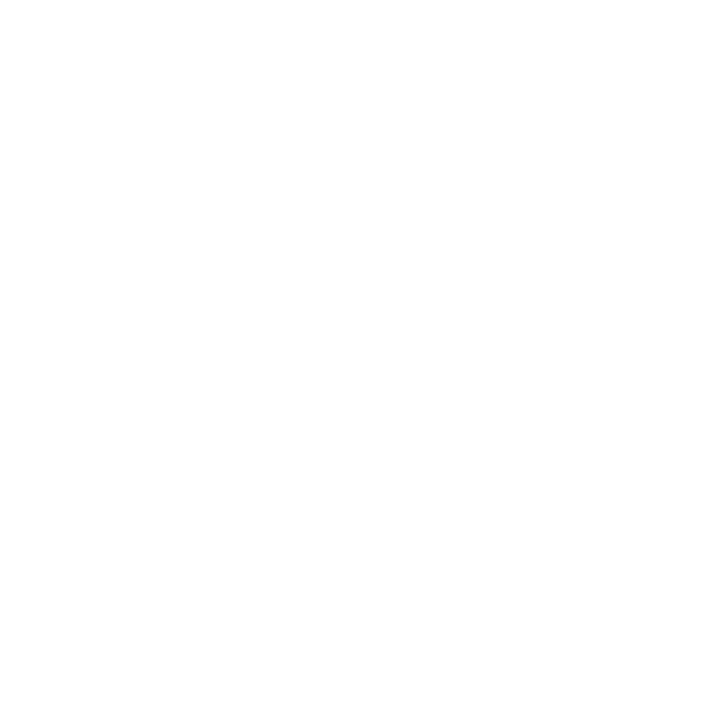

  

<h1 align="center">GSAS-LABS</h1>

  <strong>Independent Engineering & Technology Laboratory</strong>

  Exploring electronics, embedded systems, software, and open technology.

---

# 🧪 About

GSAS-LABS is an independent engineering and technology laboratory focused on experimentation, learning, and the 
development of practical projects.

The laboratory explores the intersection between hardware and software, transforming ideas into functional prototypes and 
technical projects.

Projects range from embedded devices and PCB designs to software libraries and experimental engineering tools.

---

# 🔬 What We Do

GSAS-LABS develops and experiments with technologies across multiple areas:

- 🔧 Embedded Systems
- ⚡ Electronics
- 🧠 Microcontrollers
- 🖥️ Software Engineering
- 📐 PCB Design
- 🛠️ Hardware Prototyping
- 📦 Open-Source Software
- 🔓 Open Hardware

The goal is to create projects that are practical, understandable, and well documented.

---

# 🚀 Projects

Projects developed at GSAS-LABS include experiments, prototypes, and reusable technologies.

### 🎲 P.003 — Digital Dice

A compact digital dice based on an ATtiny85 microcontroller and a 74HC595 shift register.

Features include:

- Multiple dice modes
- Configurable rolling animation
- Persistent mode selection
- Low-power operation
- Custom PCB design

➡️ Explore the project repository for firmware, hardware files, documentation, and manufacturing information.

---

# 📜 Licensing Philosophy

Different parts of a project may use different licenses depending on their purpose.

| Component | License |
|---|---|
| 💻 Firmware | [GNU GPLv3](https://www.gnu.org/licenses/gpl-3.0.html) |
| 🔧 Hardware | [CERN-OHL-S v2](https://ohwr.org/cern_ohl_s_v2.txt) |
| 🐧 GSAS-LABS Name and Logo | All Rights Reserved |

This approach allows software and hardware designs to remain open while protecting the GSAS-LABS identity and visual branding.

---

  <strong>Experiment · Build · Learn · Share</strong>

  Made with ❤️ by GSAS-LABS

